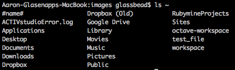
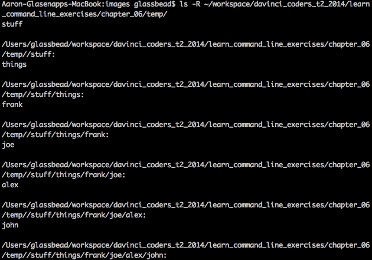

with the `-lR` option for `ls`, the l is for 'long'. it list more information about the file or directory.
the R is for 'recursive'. It goes through any directory and lists the contents. 
Then through any subdirectories of that...and so on. So it lists EVERYTHING in the directory structure below your working directory.

Chapter 6 questions:

Question | Answer
--- | ---
What does your log directory look like? | `ls log`
Can you show me what files are in that directory? | `ls log` 
What files are in your home directory? | `ls ~` 
Whats in the slash temp? | `ls /tmp`

Home, or ~/ directory contents 

 | | 
--- | --- | ---
name | Dropbox (Old) | RubymineProjects
ACTIVstudioError.log | Google Drive | Sites
Applications | Library | octave-workspace
Desktop | Movies | test_file
Documents | Music | workspace
Downloads | Pictures
Dropbox | Public

temp (in chapter_06) contents ls -R temp:
              
temp/stuff:
things

temp/stuff/things:
frank

temp/stuff/things/frank:
joe

temp/stuff/things/frank/joe:
alex

temp/stuff/things/frank/joe/alex:
john

temp/stuff/things/frank/joe/alex/john:
