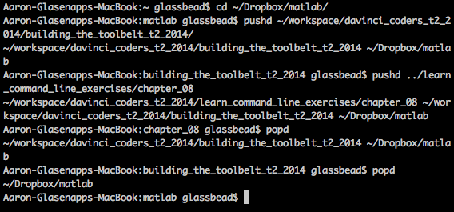

Command | Description | output description
--- | --- | ---
`pushd` | saves your current directory in some place that you can easily access later, no matter where you move to | shows the list of places that you have `pushd` as well as the directory you just moved to
`popd` | takes you to the directory where you last `pushd`d It lets you temporarily store a directory, move somewhere else completely, then teleport back to where you were with one short command. | shows the list of places you have `pushd` starting with the one you just jumped to.

A tour around my directory structure:
I started by changing to my ~/Dropbox/matlab folder.
Then I typed `pushd ~/workspace/davinci_coders_t2_2014/building_the_toolbelt_t2_2014`
this saved `matlab` in the list, and took me to building_the_toolbelt_t2_2014.
I then `pushd ../learn_command_line_exercises/chapter_08`
this saved building_the_toolbelt_t2_2014 in the list, and took me to chapter_08. From there, I `popd`, which jumped me back to bilding_the_toolbelt, and then `popd` again, which took me back to matlab. 

